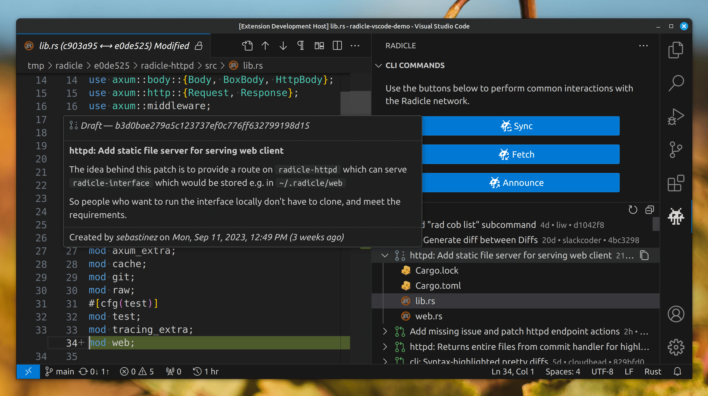

# Radicle VS Code Extension Change Log

## _(WIP, yet unreleased version)_

### 🚀 Enhancements

- **patch-detail:** improve how reactions are shown ([#103](https://github.com/cytechmobile/radicle-vscode-extension/issues/103))
  - use more subtle styling when a reaction involves the local radicle identity (italic text vs border & background)
  - show "you" instead of local identity's alias
  - on hover show the truncated DId next to each identity
- **patch-list:** show diff for copied and moved files of a patch too when available ([#100](https://github.com/cytechmobile/radicle-vscode-extension/issues/100))

### 🩹 Fixes

- **patch-detail:** restore showing reactions to comments and revisions. Addresses regression caused due to a breaking change in Radicle HTTP API (httpd) ([#103](https://github.com/cytechmobile/radicle-vscode-extension/issues/103))
- **patch-detail:** correctly show the review author in Activity and Revision sections. Previously the revision author was erroneously shown. ([#110](https://github.com/cytechmobile/radicle-vscode-extension/pull/110))

### 🏡 Chores

- **scripts:** parallelize verifying extension and webview dependencies ([#108](https://github.com/cytechmobile/radicle-vscode-extension/pull/8), [#111](https://github.com/cytechmobile/radicle-vscode-extension/pull/111))

### 🤖 CI

- **ci:** upgrade actions to their latest versions which are migrated from nodejs v16 to v20 ([#111](https://github.com/cytechmobile/radicle-vscode-extension/pull/111))

-----

## **v0.4.0** (Feb 28th, 2023)

### ✨ Highlights

- New Patch detail view

    

### 🚀 Enhancements

- **patch-detail:** implement new patch detail webview showing highly dynamic, in-depth information for a specific patch
  - can be opened via a new button "View Patch Details" on each item in the Patches view
  - panel's title shows the patch description in full if it's short, otherwise truncated to the nearest full word fitting the limit
  - the new view's design is purposefully minimal, glanceable, legible, responsive and verbose. It remains familiar to VS Code's native look'n'feel, while also staying true to Radicle's "hacky" vibe. Despite it being a full-fledged custom web-app under the hood, it successfully creates the illusion of it being just another piece of native VS Code UI.
  - view's theme adapts fully and on-the-fly (without reopening of the view) to whichever theme the user configures for his VS Code
  - view has the following main sections:
    - header
    - Patch
    - Revision
    - Activity
  - header section shows the following info:
    - status of the patch (e.g. open, merged, archived, ...)
      - the status badge's background color is a dynamic color mix of the patch status color and the dynamic editor-foreground color inherited from vscode's current theme so as to ensure text contrast reaching at least [WCAAG AA](https://developer.mozilla.org/en-US/docs/Web/Accessibility/Understanding_WCAG/Perceivable/Color_contrast) level of accessibility at all times while also retaining a relative consistency of the colors across all our UIs and user-selected themes
    - major events like "created", "last updated", "merged" and related info with logic crafting optimal copy for each case (see similar tooltip improvements below)
    - a "Refresh" button that refetches from httpd all data of that patch and updating all views that depend on it
    - a "Check Out" button that checks out the Git branch associated with the Radicle patch shown in the view
      - shown only if the patch is not checked out
    - a "Check Out Default" button that checks out the Git branch marked as default for the Radicle project
      - shown only if the patch is checked out
    - "time-ago" for major patch events gets auto-updated to remain accurate as time goes by
  - Patch section shows the following info:
    - checked-out indicator
      - not shown if the Git branch associated with this Radicle patch is not currently checked out
    - id
      - has on-hover button to copy patch identifier to clipboard
    - revision author(s)
    - labels
      - not shown if empty
    - emoji reactions to the patch
      - if the total count of reactions is 4 or less, then the reacting users' alias/truncated-Nid are shown next to each reaction
      - if the total count of reactions is 5 or more, then the count of users with the same reaction are shown next to each reaction
      - shows, on hover, the Radicle identities behind each reaction in list-ified english copy
      - if the _local_ Radicle identity is included in the reacting users, the reaction gets an additional visual cue
      - if a Radicle identity has already interacted in any other form in the patch, the identity's alias (if available) will be resolved and shown. Otherwise the identity's middle-truncated Nid (Node Identifier) will be shown (author alias is otherwise unavailable in the reaction entity).
    - title
      - supports markdown
    - description
      - supports markdown
  - Revision section shows the following info:
    - a revision selection dropdown located next to the section heading contains all revisions of the current patch as options
      - if a revision is merged it is auto-selected, otherwise it will be the most recently created
      - revisions are sorted as most-recent-top
      - revisions can be quickly browsed by using the up/down buttons while the dropdown is focused
      - revisions can be quickly searched by typing the beginning of a revision id while the dropdown is focused
      - revision are dynamically formatted so that the list can be scannable for a quick overview, while also showing only whatever info is necessary in each scenario, with the following data
        - shortened revision id
        - "mini"-sized "time-ago"
        - state
          - `merged`
            - suffixed with `/<countOfMergedRevisions>` if more than one revisions got merged e.g. `merged/3`
            - not shown if revision isn't merged
          - `accepted`
            - not shown if the revision doesn't have an `accept` review
          - `rejected`
            - not shown if the revision doesn't have a `reject` review
          - `first`
            - not shown if the revision isn't the earliest one for this patch or if it has only one revision
          - `latest`
            - not shown if the revision isn't the most recent one for this patch or if it has only one revision
          - `sole`
            - not shown if there are more than one revisions
          - not shown if empty
        - author
          - not shown if all revisions are from the same author
      - as the viewport is getting narrower the dropdown will respond by also becoming narrower to always fit within the webview. But when clicked to expand its popover listing the available revision options for selection, those options will always be shown in full, adjusting the scroll state as needed and restoring it when the popover is closed.
    - id
      - has on-hover button to copy revision identifier to clipboard
    - author
    - reviews
      - shows list of Radicle identity aliases who "accepted" and/or "rejected" the selected revision
      - not shown if empty
    - date
      - the full date the selected revision was created, in local timezone
      - shows the full date in standard ISO 8601 format
    - latest commit
      - the head commit of the selected revision
    - based on commit
      - the commit the selected revision is branched off of
    - emoji reactions to the revision
      - same behaviour as described for patch section
    - description
      - supports markdown
      - if the selected revision is the first revision, the description is hidden under an expand-on-click control (to avoid showing the same content twice since it's already shown in the Patch section)
      - not shown if empty
  - Activity section lists various patch-related events that took place across the lifetime of the patch. Each event is preceded by a "mini"-sized "time-ago" and a dedicated icon. A new event entry is listed for:
    - event for patch revision creation
      - if the patch and its first revision have the same id, the copy explicitly points that out, organically also educating the user about this Radicle fact
    - event for review of any revision, with the following data:
      - icon thumbs-up/thumbs-down/person-speaking matching the review verdict (accept/reject/null)
      - verdict of the review
      - a mention that the review was posted with "with code-inlined comments", if applicable
      - comment summary
        - not shown if empty
      - comment body
        - supports markdown
        - hidden under an expand-on-click control
        - not shown if empty
    - event for standalone-comment/discussion posted on a revision, with the following data:
      - icon comment/comment-unresolved, as well as clear textual indication for the latter case
      - whether the post was in reply to another former standalone comment
        - on click:
          - intelligently smooth-scrolls to bring that parent comment into view, if needed
          - shows a "pulse-outline" animation around the parent comment's event in the Activity section
      - comment body
        - supports markdown
        - hidden under an expand-on-click control
          - if the content is longer than 65 characters
          - or if the content is multi-paragraph, breaking among the first 65 chars (with use of double-line-break)
            - when multi-paragraph, only the first line is shown in the expand-on-click control's summary
          - control's summary shows unparsed Markdown
          - control's summary turns down to 50% opacity when expanded to further denote state and visually differentiate possibly duplicate content between summary and details
      - emoji reactions to the comment
        - same behaviour as described for patch section
    - patch merge
      - shown anew each time a different delegate merges the same patch (must happen multiple times for repos with this requirement set)
    - all of the above events also show:
      - shortened revision id
        - shows the revision description on hover, if available
        - on click:
          - selects that revision in the Revision section
          - intelligently smooth-scrolls to bring the Revision-selector control into view if needed
          - shows a "pulse-outline" animation around the Revision-selection control which just got updated
      - event author/initiator alias, or if not available, their truncated Did
        - shows the full Did on hover
  - the Activity an Revision sections come with fine-tuned responsiveness features depending on the webview viewport's width
    - when the viewport is wide they are shown in a 50/50 split two-column layout
    - as the viewport is getting narrower the Revision column gets narrower _faster_ (resulting in e.g. 70/30 split) to prioritize giving the Activity section maximum of the available horizontal real-estate since it not only hosts relatively more important content, but also one that is commonly wrapping around into new lines due to how expansive it can be. Even a few pixels narrower Activity column can result in very quickly stretching it's contents vertically as it wraps around itself.
    - when the viewport becomes less than 640px the columns will collapse in a single one and the two respective sections will get joined in a tabbed layout. State such as the selected revision in the section's dropdown persist across tab switching and column-layout changes
  - Markdown parsing comes with multiple additional features such as
    - code highlighting with an aditional label communicating the language the code is identified and highlighted as
    - task list e.g. `- [ ] task to do` and `- [X] task done`
    - SVG
    - emoji e.g. `:car:` =>  `🚗`
      - emoticons remain untouched e.g. `:)` => `:)` instead of it getting converted to `😀`, which may not match the author's initial sentiment
    - marked text e.e. `==marked==` => `<mark>inserted</mark>`
    - footnote references e.g.

        ```md
        Here is a footnote reference,[^1] and another.[^longnote]

        [^1]: Here is the footnote.
        [^longnote]: Here's one with multiple blocks.
        ```

    - subscript e.g. `C~7~H~14~O~2~`
    - superscript e.g. `x^2^`
    - abbreviation e.g. this input:

        ```md
        *[HTML]: Hyper Text Markup Language
        *[W3C]:  World Wide Web Consortium
        The HTML specification is maintained by the W3C.
        ```

        results in:

        ```html
        <p>The <abbr title="Hyper Text Markup Language">HTML</abbr> specification is maintained by the <abbr title="World Wide Web Consortium">W3C</abbr>.</p>
        ```

    - automatic table of contents generation wherever the marker `[toc]` is placed, based on previously declared headings etc
    - automatic linkification of text such as email URIs
  - patch state remains in sync with all other views
  - where applicable the various data have on-hover indicators hinting that they come with a tooltip which shows additional info such as author's DID, full Id in case it's shortened, or localised time (including the timezone used) in full text in case it's a "time-ago", etc
  - all data coming from Radicle is made visually distinct (and a bit more accessible / easier to read) from miscellaneous UI copy by rendering it using a monotype font
- **commands:** add new command to check out the current Radicle project's default Git branch
- **patch-list:** show button to "Check Out Default Git Branch" for the currently checked-out patch on the list
- **patch-list:** auto-retry fetching list of patches from httpd (with geometric back-off) if an error occured
- **patch-list:** show the total count of patches and when the list was last updated as a description next to the "Patches" view title
  - "updated-time-ago" gets auto-updated to remain accurate as time goes by or when the list is manually refreshed
  - in case of fetch error no count will be shown
- **patch-list:** improve patch tooltip with the following
  - show merge revision id and commit hash (if not already shown in revision event's copy) for merged patches
  - show latest revision id and commit hash for patches with more than the initial revision
- **patch-list:** prioritize patch merge event over latest revision when deriving author and "time-ago" for item's description and order in the list
- **patch-list:** improve legibility of time when patch events (e.g. created, last updated, merged) happened
  - don't show full dates to make the copy less noisy. The full dates are still available in the new patch detail view.
  - use custom "time-ago" logic producing more informative results with fewer collisions e.g. "35 days ago" instead of "1 month ago" etc
- **patch-list:** move button for command "Copy Patch Identifier to Clipboard" into patch item's context menu
- **patch-list:** use smaller dot as separator between data in the description of a patch item
- **sidebar:** the initial height of the Patches view (e.g. for new projects) will now be 4x that of the CLI Commands view, instead of having the area allocation split 50:50 which resulted in wasted empty space allocated to the later view while the former may have the need for more area to show more content. Subsequent adjustments by the user will be respected and not get overwritten by the initial size.
- **onboarding:** add the new default path `~/.radicle/bin/rad` defined in https://radicle.xyz/install script to the list of watched paths previously defined for the legacy package-manager-based installers
- **onboarding:** replace current standard views and an error notification shown when the Radicle CLI binary didn't get resolved succesfully, with a new dedicated Welcome View explaining the situation, setting user expectations accordingly and offering to launch the troubleshooting flow via a button.
- **onboarding:** replace whichever Welcome View ends up randomly beeing shown for a split-second while the extension is acticating with an "Activating extension..." one
- **commands:** add new command to launch Radicle CLI installation troubleshooter (available only when binary hasn't resolved)

### 🔥 Performance

- **patch-list:** only re-render the affected patch item(s) when checking out a(nother) patch (or a non-patch) branch. Previously all patches had to be re-fetched, parsed and all their list items (and their tooltips!) needed to be instantiated and rendered every time a different git branch got checked out.
- **app:** shorten the amount of time the extension needs to get activated down to about 70% of what it was before

### 🩹 Fixes

- **commands:** don't always show empty project list for command `radicle.clone` command. Now the list will also be shown with the most seeded repos at the top. Addresses regression caused due to a breaking change in Radicle HTTP API (httpd).
- **commands:** fix `radicle.clone` command not showing number of users seeding each repo in the list items. Addresses regression caused due to a breaking change in Radicle HTTP API (httpd).
- **onboarding:** fix regression causing the extension to error out (with informative error message but still...) when the path to the Radicle CLI binary didn't resolve successfully.
- **onboarding:** re-check if repo is rad-initialized and as a result properly adjust which views are available if starting without a resolved Radicle CLI and then troubleshooting it successfully (e.g. installing it for the first time).

### 🏡 Chores

- **webview:** implement infrastructure for Webviews, effectively individual websites inside a WebviewPanel, enabling the creation of bespoke custom views with the following powerful features
  - webviews can be full blown web-apps powered by Vue.js, Vite, VueUse, TailwindCSS and other great tech
  - UI in Webviews seamlessly blends with VS Code's familiar look'n'feel, even adjusting to each user's color theme
  - Webviews can have bi-directional communication with the host VS Code extension
  - initial state can be injected into a Webview, allowing reuse of already fetched data and reducing the need for loading spinners on init
  - auto-save Webview state (e.g. text in input fields) when it becomes a background tab and auto-restore it when it becomes visible again
  - auto-save Webview state and auto-restore it if VS Code is restarted with the Webview panel open
  - each new Webview panel opens in the currently active ViewColumn, if multi-column layout is in use (i.e. split editors)
  - Webview panel gets reused without being destroyed if it is re-invoked when the user has a ViewColumn active which isn't the one already containing the running Webview
  - text content in Webviews can be searched with Ctrl + F and additional actions Copy/Paste/Cut are available on right click or by using their common keyboard shortcuts
  - Webviews are secured with strict Content Security Policy (CSP)
- **state:** rewrite shared state management across the entire extension from simplistic, localised, highly interdependent and brittle, procedural approach to a new declarative, reactive, global, scalable architecture powered by [`pinia`](https://pinia.vuejs.org/) and [`@vue/reactivity`](https://www.npmjs.com/package/@vue/reactivity). This enables sharing state across sibling views/entities that was previously too hard, enabling more performant solutions and features that were previously too impractical to tackle, while the code for them can be much more maintainable and less likely to regress in the future.
- **httpd:** update typings to align with latest Radicle HTTP API endpoint schema updates

### 📖 Documentation

- **readme:** fix typos, improve title and intro copy, update milestone link
- **contributing:** document recommended extensions for development with VS Code in [.vscode/extensions.json](.vscode/extensions.json) and add related section in the repo's contribution guide.
- update all references using the now deprecated term "track" to the new term "seed" aross our docs

-----

## **v0.3.2** (Nov 29th, 2023)

### 🚀 Enhancements

- **patch-list:** show a button to check out a Radicle patch's associated git branch ([#75](https://github.com/cytechmobile/radicle-vscode-extension/issues/75))
  - show an indicator on the patch's title and tooltip if its associated branch is the currently checked-out git branch
  - keep indicator's state in sync even if the git branch change doesn't happen from within our UI (e.g. `rad patch checkout` or `git checkout` in the terminal)
  - notify user of uncommitted changes when trying to check out a patch
  - don't show check-out-button for the currently checked-out patch on the list
- **patch-list:** auto-refresh list when `pathToNodeHome` is updated in the extension settings
- **patch-list:** show a hint-text that radicle-httpd may not be running as the placeholder in Patches view, if that seems to be the case
- **patch-list:** fall back to showing their DID if the revision author's alias isn't defined ([#75](https://github.com/cytechmobile/radicle-vscode-extension/issues/75))
- **patch-list:** use new better-fitting icon for merged patches ([#75](https://github.com/cytechmobile/radicle-vscode-extension/issues/75))
- **patch-list:** improve the contrast of the colors used by patch status icons for light themes ([#75](https://github.com/cytechmobile/radicle-vscode-extension/issues/75))

### 🔥 Performance

- **app:** heavily speed up most procedures by memoizing the resolution of the reference to the rad CLI ([#75](https://github.com/cytechmobile/radicle-vscode-extension/issues/75))
- **patch-list:** heavily speed up (re-)loading of Patches view ([#75](https://github.com/cytechmobile/radicle-vscode-extension/issues/75))
  - measured ~50x faster against a real-world Project with >50 patches, with the benefit increasing proportionally with the count of patches on a project

### 📖 Documentation

- **contributing:** document how to package locally from source and import into VS Code
- fix some screenshots that were getting stretched to incorrect ratios

-----

## **v0.3.1** (Oct 3rd, 2023)

### 🩹 Fixes

- **cli:** migrate to using the new flag for sourcing the current Project's RID, which handles the breaking Radicle CLI change, resulting in Patches View getting stuck with `Unable to fetch Radicle patches for non-Radicle-initialized workspace`. ([#90](https://github.com/cytechmobile/radicle-vscode-extension/issues/90))

-----

## **v0.3.0** (Oct 2nd, 2023)

### ✨ Highlights

- New Patches view

    

### 🚀 Enhancements

- **patch-list:** show new view in the sidebar listing all Radicle Patches, including a tooltip with more info on hover and the ability to easily copy the Patch identifier ([#43](https://github.com/cytechmobile/radicle-vscode-extension/issues/43))
- **patch-list:**  each item in the list of Radicle Patches can be expanded to show a sub-list of files changed.  ([#46](https://github.com/cytechmobile/radicle-vscode-extension/issues/46))
  - If multiple items have the same filename, their directory URL will be additionally shown as the item's description.
  - On hover, a tooltip shows the relative URL of the file in the repo, and the kind of change it had.
  - A left click on a filechange item will open a diff between the original and patched file versions.
  - A right-click allows opening either the original or changed file versions (as applicable) without the diffing visual noise.
- **commands:** new VS Code command to refresh the list of Radicle Patches ([#43](https://github.com/cytechmobile/radicle-vscode-extension/issues/43))
- **commands:** new VS Code command to collapse all items in the list of Radicle Patches ([#46](https://github.com/cytechmobile/radicle-vscode-extension/issues/46))
- **ux:** convert existing flows with series of user input steps into a bespoke, cohesive experience indicating total step count and completion progress, allow editing of already submitted answers of the same flow, as well reveal-toggling of typed-in passwords, among other improvements ([#67](https://github.com/cytechmobile/radicle-vscode-extension/issues/67))
- **auth:** additionally show the alias associated with a Radicle identitifier whenever showing the latter ([#67](https://github.com/cytechmobile/radicle-vscode-extension/issues/67))

### 🛡️ Security Fixes

- **auth:** prevent potential leaking of `RAD_PASSPHRASE` into the JavaScript console ([#70](https://github.com/cytechmobile/radicle-vscode-extension/issues/70))

### 🩹 Fixes

- **auth:** don't allow the user to submit an empty string as an alias when creating a new radicle identity ([#67](https://github.com/cytechmobile/radicle-vscode-extension/issues/67))
- **auth:** warn the user that an empty passphrase will result in an unencrypted Radicle key when creating a new radicle identity ([#67](https://github.com/cytechmobile/radicle-vscode-extension/issues/67))
- **auth:** don't ask users with empty-passphrase-identities to enter their (blank) passphrase each time an auth-guarded Radicle command is executed ([#71](https://github.com/cytechmobile/radicle-vscode-extension/issues/71))
- **auth:** ask the user to re-enter their chosen passphrase when creating a new radicle identity to protect agains typos and align with Radicle CLI's UX ([#67](https://github.com/cytechmobile/radicle-vscode-extension/issues/67))
- **auth:** show "created new" instead of "unlocked" in the notification and logs when creating a new radicle identity ([#67](https://github.com/cytechmobile/radicle-vscode-extension/issues/67))
- **auth:** cancel the whole flow, warn and notify user when pressing escape _at any step of the flow_ (previously only applied for the passphrase question) when user is asked for his input in order to create a new radicle identity ([#67](https://github.com/cytechmobile/radicle-vscode-extension/issues/67))
- **httpd:** show buttons opening Output or the related configuration option in Settings in the event of Fetch Error ([#39](https://github.com/cytechmobile/radicle-vscode-extension/issues/39))

### 💅 Refactors

- **ux:** wrap VS Code's lackluster [InputBox API](https://code.visualstudio.com/api/references/vscode-api#InputBox) resulting in procedural, verbose and brittle client code, with a new custom-built sensible wrapper ([#67](https://github.com/cytechmobile/radicle-vscode-extension/issues/67))
- **httpd:** design and implement architecture for idiomatic code interacting with the Radicle HTTP API ([#39](https://github.com/cytechmobile/radicle-vscode-extension/issues/39))

### 📖 Documentation

- **readme:** use up-to-date screenshots for Integrated Authentication features ([#67](https://github.com/cytechmobile/radicle-vscode-extension/issues/67))

-----

## **v0.2.2** (July 29th, 2023)

### 🩹 Fixes

- **commands:** replace pre-heartwood, now deprecated rad pull/push commands with fetch/announce across multiple UI locations ([#42](https://github.com/cytechmobile/radicle-vscode-extension/issues/42))
- update from old (seedling) to new (alien) Radicle logo and branding ([#56](https://github.com/cytechmobile/radicle-vscode-extension/issues/56))
- **auth:** fix creation of new Radicle identity which now requires a mandatory alias ([#67](https://github.com/cytechmobile/radicle-vscode-extension/issues/67))

### 💅 Refactors

- **cli:** leverage new `rad self` calling options in place of the former brittle char-based string parsing of Radicle CLI's output ([#64](https://github.com/cytechmobile/radicle-vscode-extension/issues/64))

### 🏡 Chores

- **ts:** forbid implementing runtime logic in .d.ts files [2ccd94b](https://github.com/cytechmobile/radicle-vscode-extension/commit/2ccd94be1c42fafa1a39f1db90bb4d65199f8624)
- **ts:** skip checking npm module grammar for a ~40% compilation speedup [55d4811](https://github.com/cytechmobile/radicle-vscode-extension/commit/55d48119b21f030c42432f765e187a3c13f4e649)
- **deps:** upgrade all dependencies to latest version [5227b70](https://github.com/cytechmobile/radicle-vscode-extension/commit/5227b709f2d19426f04a43f6f75cb26b2326756f)

### 📖 Documentation

- **readme:** update screenshots to show the UI updated with the new branding ([#56](https://github.com/cytechmobile/radicle-vscode-extension/issues/56))

-----

## **v0.2.1** (June 29th, 2023)

### 🩹 Fixes

- **onboarding:** don't get stuck in "non-rad-initialized repo" Welcome View, despite having a rad-initialized repo open ([#52](https://github.com/cytechmobile/radicle-vscode-extension/issues/52))
- **onboarding:** address typos and improve copy of "non-rad-initialized repo" Welcome View ([#52](https://github.com/cytechmobile/radicle-vscode-extension/issues/52))
- **onboarding:** don't point the user to no-longer existent Getting Started guide ([#52](https://github.com/cytechmobile/radicle-vscode-extension/issues/52))

### 💅 Refactors

- **when-clause-context:** rename `isRepoRadInitialised` --> `isRadInitialized` ([#52](https://github.com/cytechmobile/radicle-vscode-extension/issues/52))

### 📖 Documentation

- **readme:** use up-to-date screenshot of "non-rad-initialized repo" Welcome View in Onboarding examples ([#52](https://github.com/cytechmobile/radicle-vscode-extension/issues/52))

-----

## **v0.2.0** (June 28th, 2023)

### ✨ Highlights

- ❤️🪵 Initial ["Heartwood"](https://app.radicle.xyz/seeds/seed.radicle.xyz/rad:z3gqcJUoA1n9HaHKufZs5FCSGazv5) support
- 🔐 Integrated authentication
- 📥 Cloning of seeded Radicle projects
- 🏗️ Improved development tooling and infrastructure for maintainers

### 🚀 Enhancements

- **commands:** wrap Radicle CLI commands (`sync`, etc) with auth requirement ([#28](https://github.com/cytechmobile/radicle-vscode-extension/issues/28))
- **auth:** unlock existing and create new Radicle identities using familiar VS Code UX ([#28](https://github.com/cytechmobile/radicle-vscode-extension/issues/28))
- **auth:** validate passphrase correctness in realtime as the user is typing it ([#28](https://github.com/cytechmobile/radicle-vscode-extension/issues/28))
- **auth:** securely store passphrase after successful user input and autotomatically re-use next time (if available) ([#28](https://github.com/cytechmobile/radicle-vscode-extension/issues/28))
- **commands:** new VS Code command to de-authenticate / re-lock the currently used Radicle identity and remove the associated passphrase from Secret Storage ([#33](https://github.com/cytechmobile/radicle-vscode-extension/issues/33))
- **log:** indicate in logs and notifications if an identity was pre-unlocked, got auto-unlocked using stored passphrase, got unlocked with user provided passphrase, or got created anew ([#28](https://github.com/cytechmobile/radicle-vscode-extension/issues/28))
- **config:** new `pathToNodeHome` setting, which sets the `RAD_HOME` env variable ([#28](https://github.com/cytechmobile/radicle-vscode-extension/issues/28))
- **config:**  new `httpApiEndpoint` setting, useful when reverse-proxies are running in front of `radicle-httpd` etc ([#26](https://github.com/cytechmobile/radicle-vscode-extension/issues/26))
- **commands:** new VS Code command to clone a Radicle project from a filterable list of all seeded ones ([#27](https://github.com/cytechmobile/radicle-vscode-extension/issues/27))
- **commands:** show rad clone command in the native Source Control three-dot-menu's Radicle submenu ([#27](https://github.com/cytechmobile/radicle-vscode-extension/issues/27))
- **onboarding:** when opening VS Code without any folder in the workspace show in the dedicated Welcome View an additional button to clone from Radicle ([#27](https://github.com/cytechmobile/radicle-vscode-extension/issues/27))
- **config:** set default value for existing config `pathToRadBinary` ([#28](https://github.com/cytechmobile/radicle-vscode-extension/issues/28))
- **log:** log auth status on extension init as well as on `pathToCliBinary` and `pathToNodeHome` configs' change ([#28](https://github.com/cytechmobile/radicle-vscode-extension/issues/28))

### 🩹 Fixes

- **config:** use previously ignored config `pathToCliBinary` to resolve Radicle CLI before executing commands ([#28](https://github.com/cytechmobile/radicle-vscode-extension/issues/28))
- **log:** don't log `body` param if it is empty string
- **log:** escalate user notification shown when Radicle CLI is not resolved from warning to error ([#28](https://github.com/cytechmobile/radicle-vscode-extension/issues/28))

### 💅 Refactors

- **store:** create new global store for extension context and replace func param drilling with new getter ([#28](https://github.com/cytechmobile/radicle-vscode-extension/issues/28))
- **exec:** completely rewrite foundational logic for shell script execution to be simpler, more powerful and result in cleaner client code ([#28](https://github.com/cytechmobile/radicle-vscode-extension/issues/28))
- **config:** use new typesafe getter and setter for accessing VS Code configuration options ([#28](https://github.com/cytechmobile/radicle-vscode-extension/issues/28))
- **config:** rename config `pathToBinary` -> `pathToCliBinary` ([#28](https://github.com/cytechmobile/radicle-vscode-extension/issues/28))
- **repo:** move functions out of overgrown `utils` directory and into new `helpers` and `ux` directories ([#34](https://github.com/cytechmobile/radicle-vscode-extension/issues/34))
- **repo:** add readme files documenting the intended contents of `utils`, `helpers` and `ux` directories ([8da729e](https://github.com/cytechmobile/radicle-vscode-extension/commit/8da729ee16726484859cf4c56592c7d7189699f8))

### 🏡 Chores

- **build:** support runtime dependencies by bundling them and our source code for production using esbuild ([#41](https://github.com/cytechmobile/radicle-vscode-extension/issues/41))
- **lint:** massively improve code linting ruleset, integrate code formatter in it and update all source code to comply ([#13](https://github.com/cytechmobile/radicle-vscode-extension/issues/13))
- **lint:** auto-fix most code linting & formatting issues on save for VS Code users with ESLint extension installed ([#13](https://github.com/cytechmobile/radicle-vscode-extension/issues/13))
- **deps:** migrate to Typescript v5.0 ([1234e06](https://github.com/cytechmobile/radicle-vscode-extension/commit/1234e06112ecc941c213614852bdb53037cd6833))

### 🤖 CI

- **ci:** set-up github actions for pull requests ([#1](https://github.com/cytechmobile/radicle-vscode-extension/issues/1))

### 📖 Documentation

- **readme:** add CTA advertising the change log ([#28](https://github.com/cytechmobile/radicle-vscode-extension/issues/28))
- **readme:** bring up to date with latest changes ([#48](https://github.com/cytechmobile/radicle-vscode-extension/issues/48))
- **changelog:** add release date to title of each version and separators above them ([#28](https://github.com/cytechmobile/radicle-vscode-extension/issues/28))
- **changelog:** reference related PRs/commits for each change ([#48](https://github.com/cytechmobile/radicle-vscode-extension/issues/48))

-----

## **v0.1.2** (April 25th, 2023)

### 🩹 Fixes

- **commands:** hide Radicle commands from UI when they are not applicable ([#25](https://github.com/cytechmobile/radicle-vscode-extension/issues/25))

### 🏡 Chores

- **git:** define known scopes for conventionalCommits extension ([ded7fcf](https://github.com/cytechmobile/radicle-vscode-extension/commit/ded7fcf64d7864a95a96bc53df0512d41bfbe0f5))

### 📖 Documentation

- **readme:** add missing reference to integrated logging feature
- **readme:** fix link to Radicle homepage
- **readme:** fix broken reference to image showcasing integrated logging feature
- **changelog:** prefix changes with context and remove quotations formatting

-----

## **v0.1.1** (April 5th, 2023)

### 🩹 Fixes

- **commands:** use a more minimal UI to notify user of Radicle command success
- **onboarding:** typo fix in copy of non-rad-initialized repo's Welcome View (thanks for reporting @bordumb 🙌)

### 📖 Documentation

- **readme:** revamp with simpler feature list, visual examples of each and a short definition of the Radicle network
- **changelog:** polishing of enhancements list of v0.0.1

-----

## **v0.1.0** (April 5th, 2023)

Minor version bump to officially mark the release of the long-awaited MVP! 🥳

Please refer to [v0.0.1](#v001) for the shiny features list ✨ (bear with us as we work out our versioning/release/changelog/documentation flows)

### 📖 Documentation

- **changelog:** improve copy of features list

## **v0.0.3** (April 5th, 2023)

### 📖 Documentation

- **readme:** update and partially extract content to CONTRIBUTING

-----

## **v0.0.2** (April 5th, 2023)

### 🏡 Chores

- **publish:** remove unnecessary files from published artifact

### 📖 Documentation

- **changelog:** introduce Changelog

-----

## **v0.0.1** (April 5th, 2023)

An MVP bringing getting-started and troubleshooting flows as well as basic (pre-Heartwood) Radicle integration to VS Code.

### 🚀 Enhancements

- Radicle icon in Activity Bar opening the main extension View
- Buttons to execute Pull, Push Sync Radicle commands in the main extension View
- Button to execute Sync Radicle command in native Source Control View's title buttons (above commit message input)
- Commands to execute Pull, Push Sync Radicle commands in VS Code's Command Palette (Opens with Ctrl+Shift+P or Cmd+Shift+P)
- List items to execute Pull, Push Sync Radicle commands grouped in a "Radicle" submenu inside the native Source Control View's three-dot-menu
- User notification on success/failure of executed Radicle commands with the option to view the CLI's output
- Log including extension's and Radicle CLI's version in the Output Panel
- Command to show extension's Log in VS Code's Command Palette
- Multi-step onboarding flow with dedicated Welcome Views for specific Workspace states
- Multi-step and multi-branch Radicle CLI installation troubleshooting flow helping the user point the extension to a Radicle CLI binary
- Configurable path to CLI binary in the Settings (by default will not sync VS Code instances as other user settings do)
