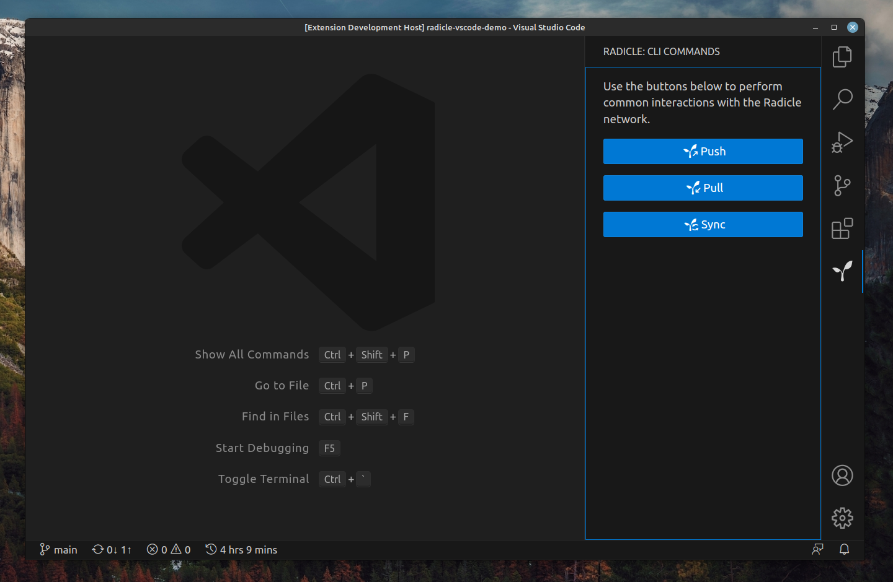

# Radicle

A VS Code extension bringing support for the [Radicle network](https://radicle.xyz/) to your IDE.

> **NOTE:** supports Radicle CLI up to v0.6.x . Support for newer experimental newer versions of the CLI (codename "Heartwood") is under [active development](https://github.com/orgs/cytechmobile/projects/9/views/1?query=is%3Aopen+sort%3Aupdated-desc).

## Features include

- Radicle icon in Activity Bar opening the main extension View
- Buttons to execute Pull, Push Sync Radicle commands in Activity Bar
- Button to execute Sync Radicle command in native Source Control View's title buttons (above commit message input)
- Options to execute Pull, Push Sync Radicle commands as a "Radicle" submenu in native Source Control View's three-dot-menu
- User notification on success/failure of executed Radicle commands with the option to view the command's output on failure
- Commands to execute Pull, Push Sync Radicle commands in VS Code's Command Palette (Opens with Ctrl + Shift + P or Cmd + Shift + P)
- Log including extension's and Radicle CLI's version in the Output Panel
- Command to show extension's Log in VS Code's Command Palette
- Multi-step onboarding flow with dedicated Welcome Views for specific Workspace states
- Multi-step and multi-branch Radicle CLI installation troubleshooting flow helping the user point the extension to a Radicle CLI binary
- Custom path to CLI binary configurable in the Settings (by default will not sync across VS Code instances as other user settings do)

## Contributing

Please see the [Contribution Guide](./CONTRIBUTING.md).
