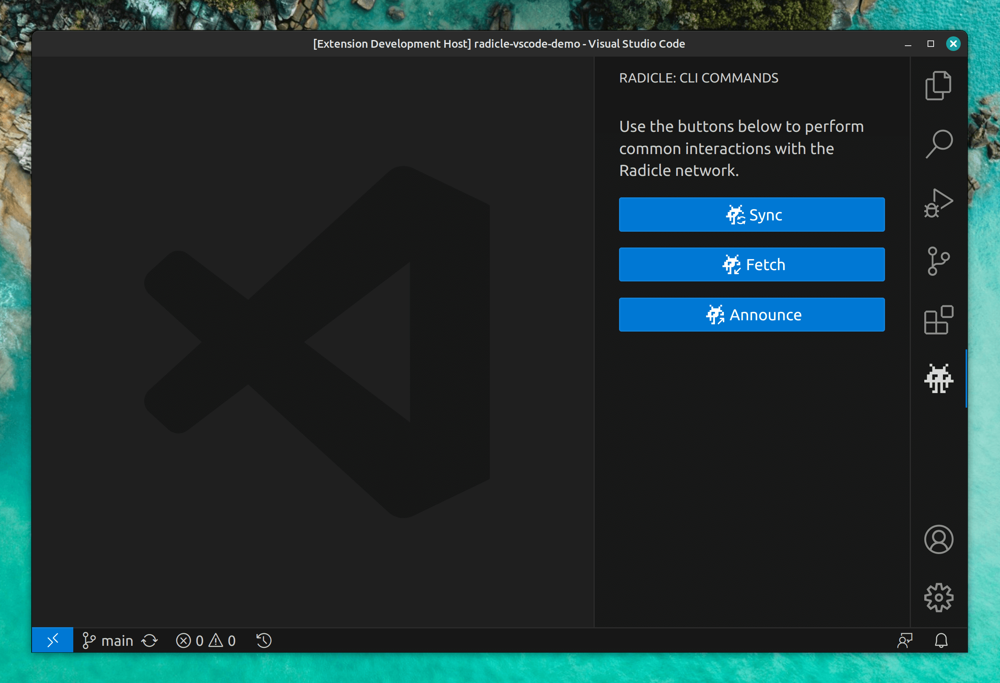

# Radicle

A VS Code extension bringing support for the Radicle network to your IDE.

[Radicle](https://radicle.xyz/) is a Github alternative bringing familiar features (e.g. Pull Requests, Issues, etc) over a free, open-source and peer-to-peer network, built on top of Git.

> **NOTE:** The extension currently offers partial support for the latest version of the Radicle CLI (codename "Heartwood"). Support for Radicle Patches is [under active develpment](https://github.com/cytechmobile/radicle-vscode-extension/milestone/3) and further features like Issues are next on the pipeline.

## Features

> _See the latest, as well as upcoming, updates in the [🗒️ Change Log](CHANGELOG.md)._

- 🖲️ [Execute Radicle Commands](#integrated-radicle-commands) right from your IDE. Use whichever of the multiple integrated ways fits your workflow best.
- 📋 [Patches View](#patches-view) offers a quick glance at the status of code changes in your project
- 🔐 [Integrated Authentication](#integrated-authentication) eases your Radicle Identity management
- 📥 [Cloning](#cloning) of tracked Radicle projects
- 🗺️ [Onboarding Flow](#onboarding-flow) with tips specialized to whichever state your Workspace is in when starting out
- 🕵️‍♂️ [Troubleshooting Flow](#troubleshooting-flow) helping you point the extension to a Radicle CLI binary (if it didn't already auto-resolve)
- 🎛️ [Configurable](#configurable) via VS Code's native Settings
- 📜 [Integrated Logging](#integrated-logging) including Radicle command output

### Integrated Radicle Commands

- Execute common Radicle commands with dedicated buttons from within the main extension View

    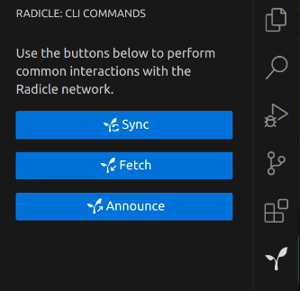

- Execute Radicle commands from within VS Code's Command Palette

    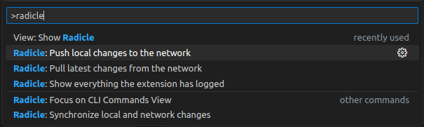

- Sync with the Radicle network with a dedicated button among the native Source Control View's title buttons (above commit message input)

    

- Find Radicle commands grouped as a "Radicle" submenu inside the native Source Control View's three-dot-menu

    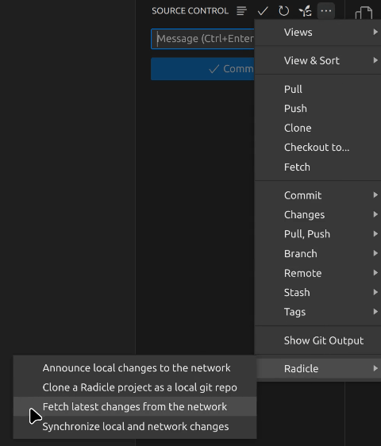

### Patches View

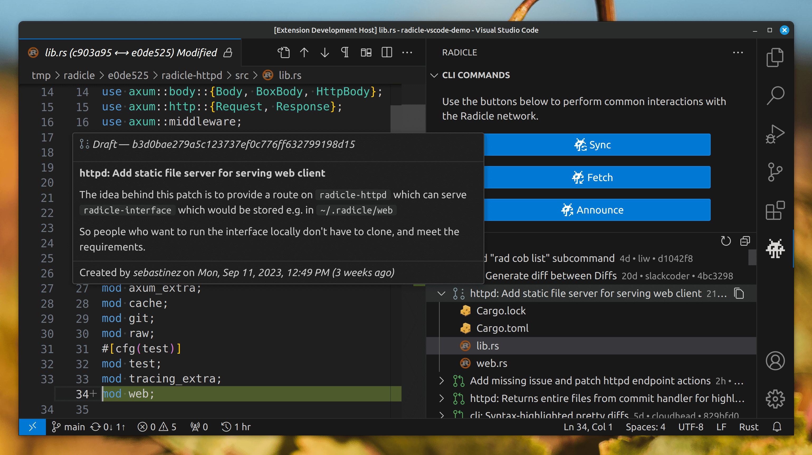

### Integrated Authentication

- Create a new Radicle identity, if none exists in your configured Radicle home directory

    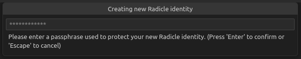

- Unlock an existing identity

    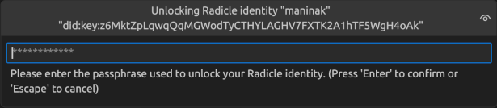

- De-authenticate your currently unlocked identity

    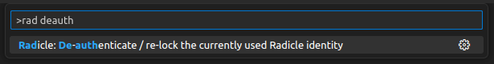

### Cloning

- Invoke the CLI's `rad clone` command from the Command Palette

    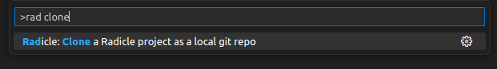

- Select from a filterable list of projects that your Radicle node is tracking

    

- Open the newly cloned repo in another VS Code window with a single click

    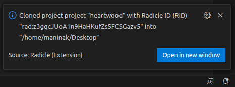

### Onboarding Flow

- No folder opened in Workspace

    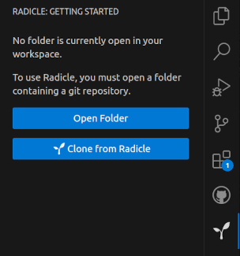

- Non-git-initialized folder opened in Workspace

    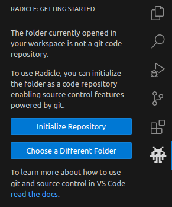

- Non-radicle-initialized repo opened in Workspace

    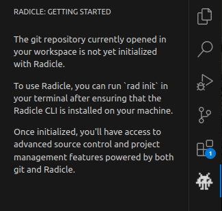

### Troubleshooting Flow

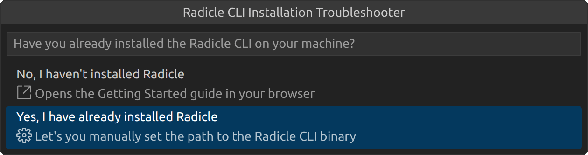

### Configurable

Set environment variables for the Radicle CLI and more from VS Code's settings

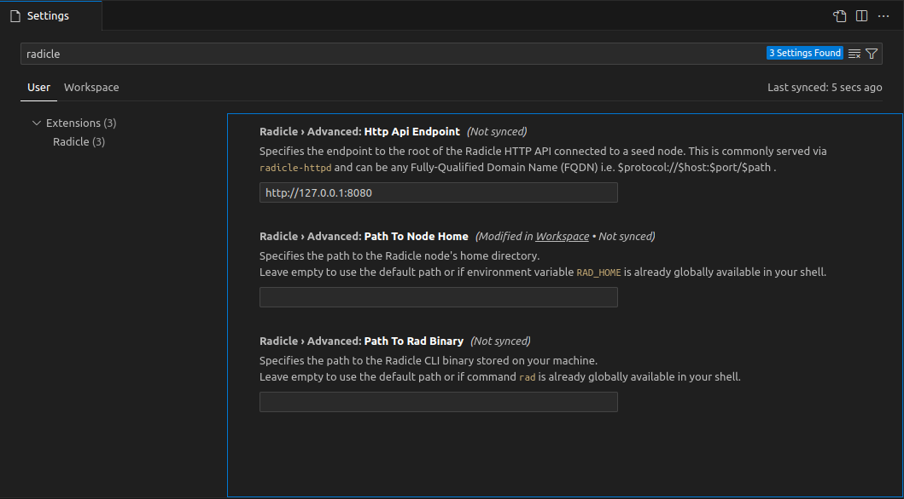

### Integrated Logging

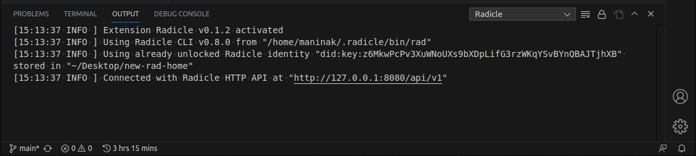

## Contributing

Please see the [Contribution Guide](./CONTRIBUTING.md).
