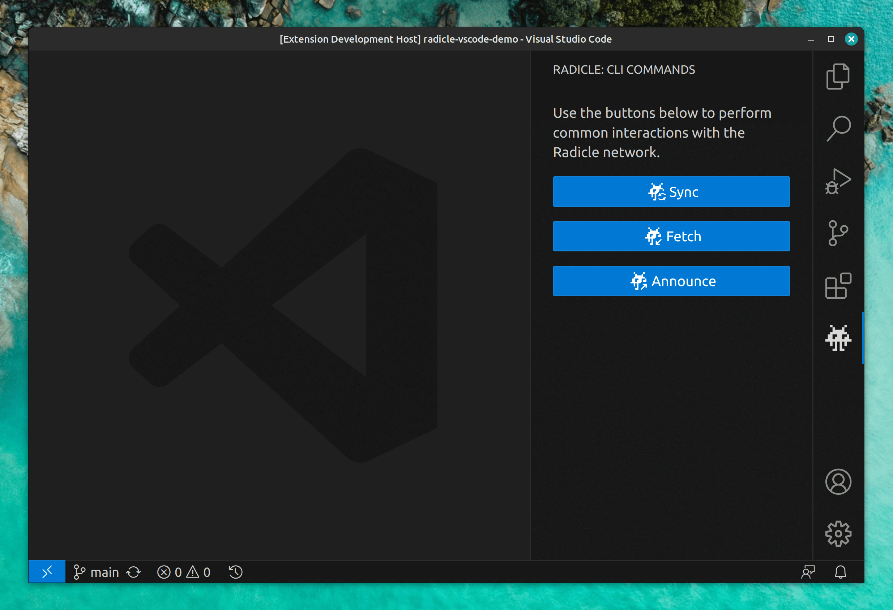

# Radicle VS Code Extension

A VS Code extension bringing support for the Radicle network to your IDE.

[Radicle](https://radicle.dev/) is a GitHub alternative with familiar features like Pull Requests, Issues, etc, via a peer-to-peer, free and open-source network built on top of Git.

> **NOTE:** Requires [Radicle HTTP Daemon](https://radicle.dev/download#radicle-httpd-release-name) >=0.17.0

> **NOTE:** The extension currently offers a limited feature set. Removal of HTTPD as a dependency is next up. Beyond that comes deeper integration of Patches and then Issues are next up.

## Features

> _See the latest, as well as upcoming, updates in the [🗒️ Change Log](./CHANGELOG.md)._

- 🖲️ [Radicle Commands](#integrated-radicle-commands) everywhere you need them
- 📋 [Patches View](#patches-view) offers a glance at the status of code changes in your repository
- 📑 [Patch Detail View](#patch-detail-view) gives you in-depth information and interactivity for a specific patch
- 🔐 [Integrated Authentication](#integrated-authentication) eases your Radicle Identity management
- 📥 [Cloning](#cloning) of seeded Radicle repos
- 🗺️ [Onboarding Flow](#onboarding-flow) with tips tuned to whichever state your Workspace is in when starting out
- 🕵️‍♂️ [Troubleshooting Flow](#troubleshooting-flow) helping you point the extension to a Radicle CLI binary (if it didn't already auto-resolve)
- 🎛️ [Configurable](#configurable) via VS Code's native Settings
- 📜 [Integrated Logging](#integrated-logging) including Radicle CLI's command output

### Integrated Radicle Commands

- Run common Radicle commands with dedicated buttons from within the main extension View

  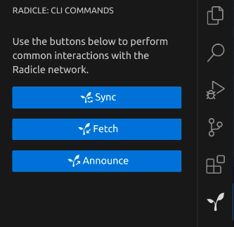

- Run Radicle commands from within VS Code's Command Palette

  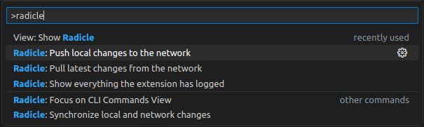

- Sync with the Radicle network with a dedicated button among the native Source Control View's title buttons (above commit message input)

  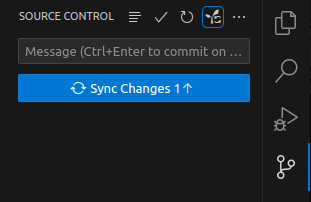

- Find Radicle commands grouped as a "Radicle" submenu inside the native Source Control View's three-dot-menu

  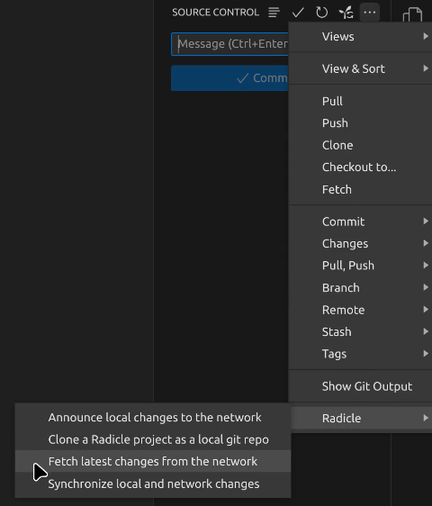

### Patches View

Browse Radicle Patches, check out their associated git branches and inspect their file changes and diffs.

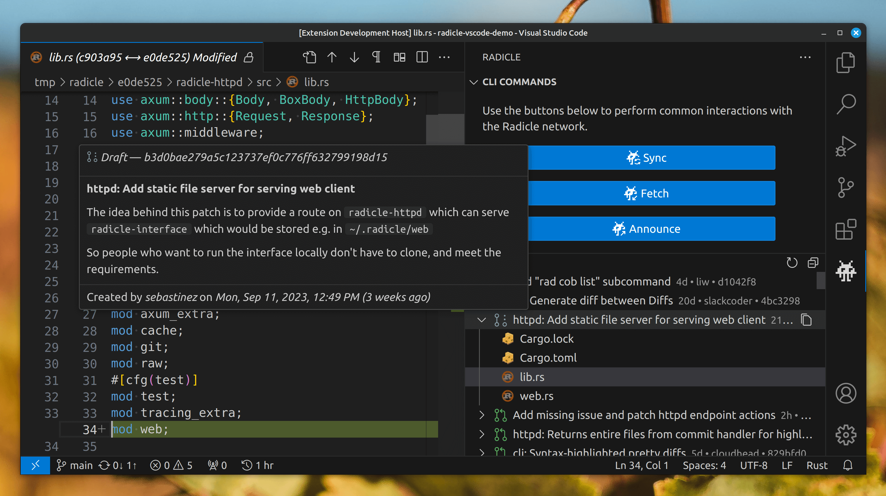

### Patch Detail View

Inspect all details you'd want to know about a patch including discussions, details of a specific revision as well as all events that took place during the lifetime of the patch.

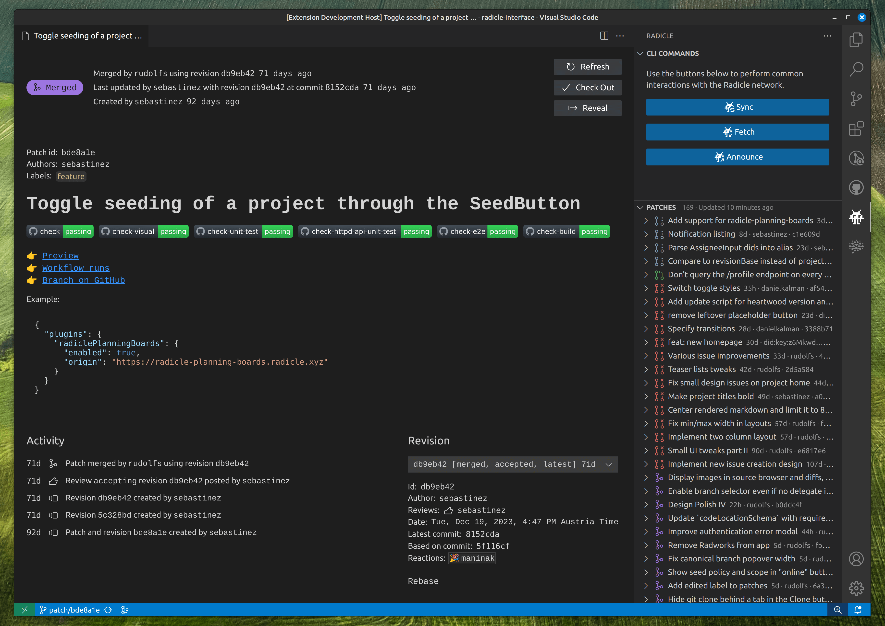

### Integrated Authentication

- Create a new Radicle identity, if none exists in your configured Radicle home directory

  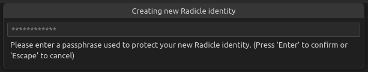

- Unlock an existing identity

  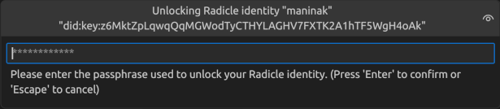

- De-authenticate your currently unlocked identity

  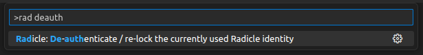

### Cloning

- Invoke the CLI's `rad clone` command from the Command Palette

  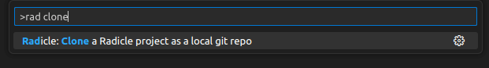

- Select from a filterable list of repos that your Radicle node is seeding

  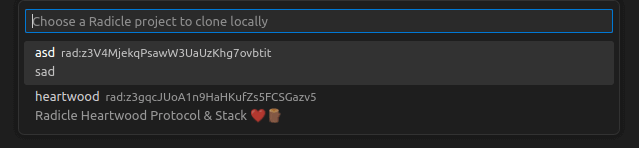

- Open the newly cloned repo in another VS Code window with a single click

  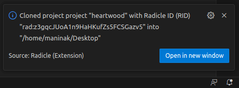

### Onboarding Flow

- No folder opened in Workspace

  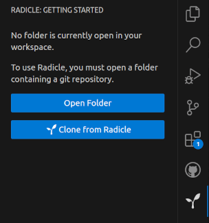

- Non-git-initialized folder opened in Workspace

  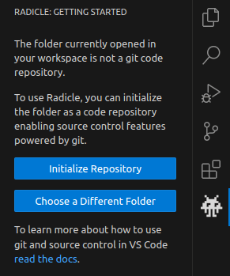

- Non-radicle-initialized repo opened in Workspace

  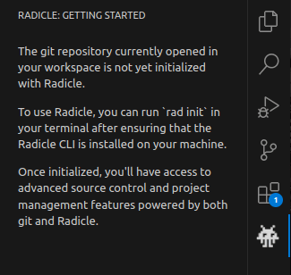

### Troubleshooting Flow

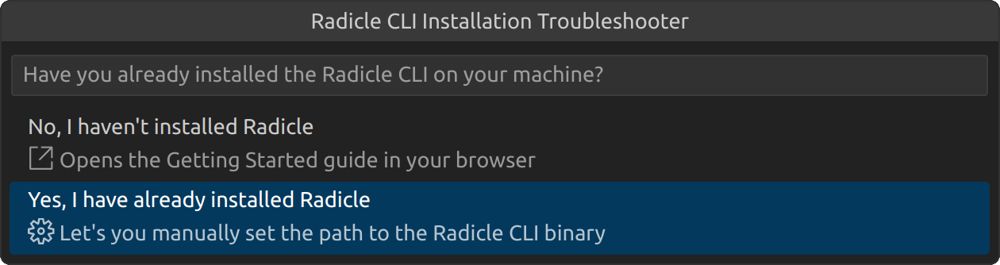

### Configurable

Set environment variables for the Radicle CLI and more from VS Code's settings

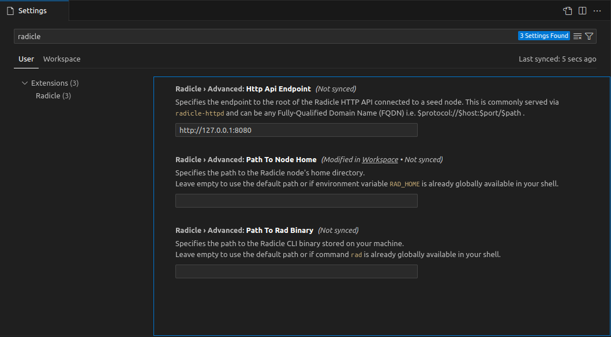

### Integrated Logging

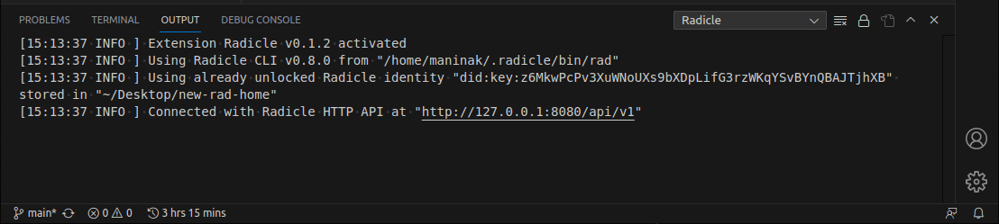

## Contributing

Please see the [Contribution Guide](./CONTRIBUTING.md).

## Support

If this extension saves you time, or you would like to see it keep getting better, here are a few ways to appreciate prior and support further development:

- 🌱 Star this repo on [GitHub](https://github.com/cytechmobile/radicle-vscode-extension) and seed it on [Radicle](https://app.radicle.at/nodes/seed.radicle.at/rad:z3Makm6fsQQXmpSFE43DZqwupaEhk)
- 🗣️ Share it with colleagues, or leave a rating on the [VS Marketplace](https://marketplace.visualstudio.com/items?itemName=radicle-ide-plugins-team.radicle) or [Open VSX](https://open-vsx.org/extension/radicle-ide-plugins-team/radicle)
- 💛 Chip in a recurring micro-donation on Liberapay, if you can comfortably spare it.

Every bit, a kind message included, makes maintaining this and my other open-source tools more sustainable. Thank you!
