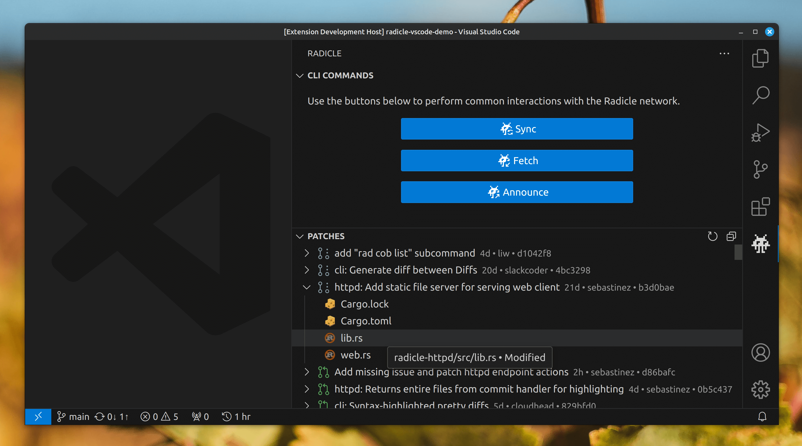
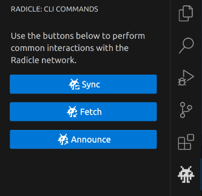
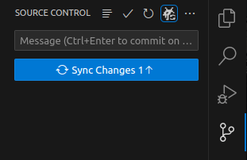

# Radicle

A VS Code extension bringing support for the Radicle network to your IDE.

[Radicle]((https://radicle.xyz/)) is a Github alternative bringing familiar features (e.g. Pull Requests, Issues, etc) over a free, open-source and peer-to-peer network, built on top of Git.

> **NOTE:** The extension supports the Radicle CLI up to v0.6.x . Support for experimental newer versions of the CLI (codename "Heartwood") is [planned](https://github.com/cytechmobile/radicle-vscode-extension/milestone/2) and coming soon.

## Features

- Multiple integrated ways to [execute Radicle commands](#integrated-radicle-commands) right from your IDE. Use whichever fits your workflow best.
- [Onboarding flow](#onboarding-flow) with tips specialized to whichever state your Workspace is in when starting out
- [Notifications](#user-notifications) will inform you of important events or warn you if something is wrong, sometimes even offering assistance to fix the issue (while trying not to spam you)
- [Troubleshooting flow](#troubleshooting-flow) helping you point the extension to a Radicle CLI binary (if it didn't already auto-resolve)
- [Configurable path to CLI binary](#configurable-path-to-cli-binary) in the Settings (by default will not sync VS Code instances as other user settings do)

### Integrated Radicle Commands

- Buttons to execute Pull, Push Sync Radicle commands in the main extension View

    

- Commands to execute Pull, Push Sync Radicle commands in VS Code's Command Palette

    

- Button to execute Sync Radicle command in native Source Control View's title buttons (above commit message input)

    

- List items to execute Pull, Push Sync Radicle commands grouped in a "Radicle" submenu inside the native Source Control View's three-dot-menu

    

### Onboarding Flow

- Non-git-initialized folder opened in Workspace

    

- Non-radicle-initialized repo opened in Workspace

    

- _etc._

### User Notifications

- Successful execution of Radicle CLI commands

    

- Failed execution of Radicle CLI commands

    

- Extension could not resolve Radicle CLI

    

- Radicle CLI installation just got fixed

    

### Troubleshooting Flow

### Configurable path to CLI binary

## Contributing

Please see the [Contribution Guide](./CONTRIBUTING.md).
